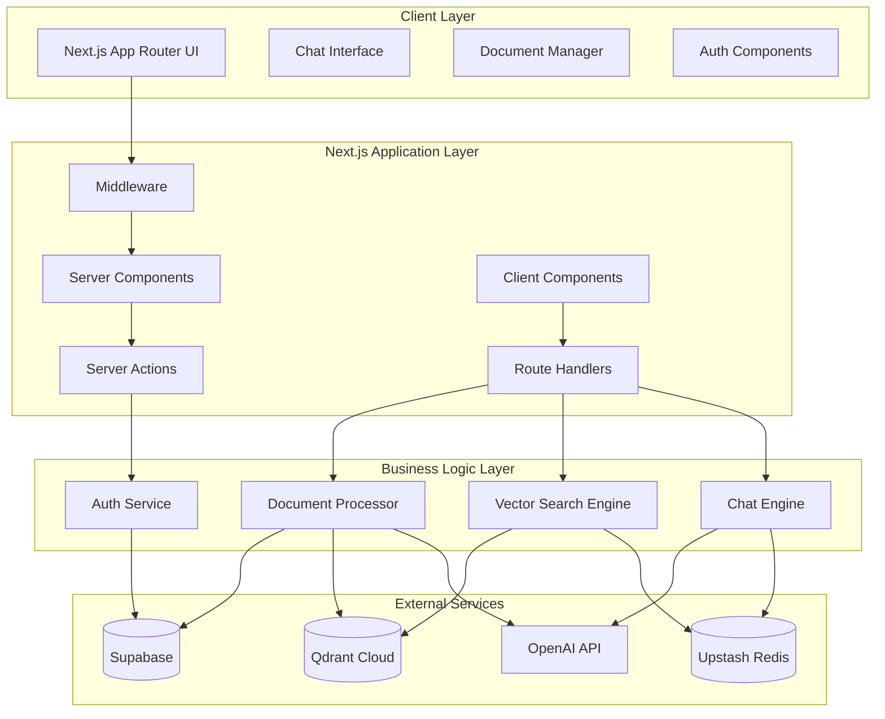

# Design Document: Next.js RAG Chatbot

## Overview

This document outlines the design for a production-ready Next.js RAG (Retrieval-Augmented Generation) chatbot application. The system combines document processing, vector search, and conversational AI to provide contextual responses based on user-uploaded documents. The architecture leverages Next.js App Router, Vercel AI SDK, Supabase for authentication and data storage, Qdrant Cloud for vector search, Upstash Redis for caching, and OpenAI for embeddings and chat completion.

The design prioritizes performance, scalability, and maintainability while following Next.js best practices and ensuring compatibility with Vercel's hobby plan deployment constraints.

## Architecture

### High-Level Architecture



### System Components

1. **Presentation Layer**: Next.js App Router with Server/Client Components
2. **API Layer**: Route Handlers and Server Actions
3. **Business Logic**: Document processing, vector search, and chat engines
4. **Data Layer**: Supabase (PostgreSQL), Qdrant (Vector DB), Redis (Cache)
5. **External Services**: OpenAI API for embeddings and chat completion

## Components and Interfaces

### 1. Authentication System

**Architecture Pattern**: Next.js Middleware + Supabase Auth

```typescript
// middleware.ts
export async function middleware(request: NextRequest) {
  const { supabase, response } = createMiddlewareClient({ req: request })
  const { data: { session } } = await supabase.auth.getSession()
  
  // Route protection logic
  if (!session && isProtectedRoute(request.nextUrl.pathname)) {
    return NextResponse.redirect(new URL('/auth/login', request.url))
  }
  
  return response
}

// Auth Service Interface
interface AuthService {
  signInWithMagicLink(email: string): Promise<AuthResponse>
  signInWithOTP(email: string, token: string): Promise<AuthResponse>
  signOut(): Promise<void>
  getSession(): Promise<Session | null>
}
```

**Key Features**:
- Passwordless authentication (magic link + OTP)
- Session management with JWT tokens
- Route protection via middleware
- Automatic token refresh

### 2. Document Processing System

**Architecture Pattern**: Server Actions + Streaming + Background Processing

```typescript
// Document Processing Interface
interface DocumentProcessor {
  uploadDocument(file: File, userId: string): Promise<DocumentUploadResult>
  processDocument(documentId: string): Promise<ProcessingResult>
  deleteDocument(documentId: string, userId: string): Promise<void>
  getDocuments(userId: string): Promise<Document[]>
}

// Processing Pipeline
class DocumentProcessingPipeline {
  async process(document: Document): Promise<void> {
    // 1. Extract text content
    const content = await this.extractText(document)
    
    // 2. Chunk content with overlap
    const chunks = await this.chunkContent(content, {
      chunkSize: 500,
      chunkOverlap: 50
    })
    
    // 3. Generate embeddings
    const embeddings = await this.generateEmbeddings(chunks)
    
    // 4. Store in vector database
    await this.storeVectors(embeddings, document.id)
    
    // 5. Update document status
    await this.updateDocumentStatus(document.id, 'processed')
  }
}
```

**Key Features**:
- Streaming file uploads with progress tracking
- Recursive text chunking with configurable overlap
- Batch embedding generation with rate limiting
- Background processing with status updates
- Error handling and retry mechanisms

### 3. Vector Search Engine

**Architecture Pattern**: Hybrid Search + Caching + Reranking

```typescript
// Vector Search Interface
interface VectorSearchEngine {
  search(query: string, options: SearchOptions): Promise<SearchResult[]>
  addDocuments(documents: DocumentChunk[]): Promise<void>
  deleteDocuments(documentIds: string[]): Promise<void>
}

// Search Implementation
class QdrantVectorSearch implements VectorSearchEngine {
  async search(query: string, options: SearchOptions): Promise<SearchResult[]> {
    // 1. Check cache first
    const cacheKey = this.generateCacheKey(query, options)
    const cached = await this.redis.get(cacheKey)
    if (cached) return JSON.parse(cached)
    
    // 2. Generate query embedding
    const queryEmbedding = await this.openai.embeddings.create({
      model: 'text-embedding-3-small',
      input: query
    })
    
    // 3. Search Qdrant
    const results = await this.qdrant.search(this.collectionName, {
      vector: queryEmbedding.data[0].embedding,
      limit: options.topK || 5,
      score_threshold: options.threshold || 0.7
    })
    
    // 4. Rerank results
    const reranked = await this.rerankResults(results, query)
    
    // 5. Cache results
    await this.redis.setex(cacheKey, 300, JSON.stringify(reranked))
    
    return reranked
  }
}
```

**Key Features**:
- Semantic similarity search with configurable thresholds
- Redis caching for query results
- Result reranking for improved relevance
- Hybrid scoring (semantic + keyword + recency)
- Batch operations for efficiency

### 4. Chat Engine

**Architecture Pattern**: Vercel AI SDK + Streaming + Context Management

```typescript
// Chat Engine Interface
interface ChatEngine {
  generateResponse(
    messages: Message[],
    context: DocumentChunk[],
    options: ChatOptions
  ): Promise<ReadableStream>
}

// Implementation with Vercel AI SDK
export async function POST(req: Request) {
  const { messages, userId } = await req.json()
  
  // 1. Get relevant context
  const lastMessage = messages[messages.length - 1]
  const context = await vectorSearch.search(lastMessage.content, {
    userId,
    topK: 5,
    threshold: 0.7
  })
  
  // 2. Build system prompt with context
  const systemPrompt = buildSystemPrompt(context)
  
  // 3. Generate streaming response
  const result = await streamText({
    model: openai('gpt-4-turbo'),
    messages: [
      { role: 'system', content: systemPrompt },
      ...messages
    ],
    temperature: 0.1,
    maxTokens: 1000
  })
  
  return result.toAIStreamResponse()
}
```

**Key Features**:
- Real-time streaming responses
- Context-aware prompt engineering
- Conversation history management
- Source citation and attribution
- Error handling and fallback responses

### 5. User Interface System

**Architecture Pattern**: shadcn/ui + Tailwind CSS + Responsive Design

```typescript
// UI Component Architecture
interface UIComponentSystem {
  // Core UI Components
  Button: ComponentType<ButtonProps>
  Input: ComponentType<InputProps>
  Card: ComponentType<CardProps>
  Alert: ComponentType<AlertProps>
  RadioGroup: ComponentType<RadioGroupProps>
  Textarea: ComponentType<TextareaProps>
  
  // Layout Components
  Sidebar: ComponentType<SidebarProps>
  Header: ComponentType<HeaderProps>
  Layout: ComponentType<LayoutProps>
  
  // Feature Components
  DocumentUploader: ComponentType<DocumentUploaderProps>
  ChatInterface: ComponentType<ChatInterfaceProps>
  MessageList: ComponentType<MessageListProps>
}

// Design System Configuration
const designSystem = {
  colors: {
    primary: 'hsl(222.2 84% 4.9%)',
    secondary: 'hsl(210 40% 96%)',
    accent: 'hsl(210 40% 94%)',
    muted: 'hsl(210 40% 96%)',
    destructive: 'hsl(0 84.2% 60.2%)',
  },
  typography: {
    fontFamily: 'Inter, system-ui, sans-serif',
    fontSize: {
      xs: '0.75rem',
      sm: '0.875rem',
      base: '1rem',
      lg: '1.125rem',
      xl: '1.25rem',
    }
  },
  spacing: {
    xs: '0.25rem',
    sm: '0.5rem',
    md: '1rem',
    lg: '1.5rem',
    xl: '2rem',
  }
}
```

**Key Features**:
- Consistent design system with CSS variables
- Responsive breakpoints for all screen sizes
- Accessible components with proper ARIA labels
- Dark/light mode support with system preference detection
- Smooth animations and transitions
- Loading states and skeleton screens

### 6. Layout and Navigation System

**Architecture Pattern**: Nested Layouts + Progressive Enhancement

```typescript
// Layout Hierarchy
interface LayoutSystem {
  RootLayout: ComponentType<{ children: ReactNode }>
  AuthLayout: ComponentType<{ children: ReactNode }>
  DashboardLayout: ComponentType<{ children: ReactNode }>
  ChatLayout: ComponentType<{ children: ReactNode }>
}

// Navigation Structure
const navigationStructure = {
  public: [
    { path: '/', label: 'Home' },
    { path: '/auth/login', label: 'Sign In' },
  ],
  authenticated: [
    { path: '/dashboard', label: 'Dashboard', icon: 'Home' },
    { path: '/documents', label: 'Documents', icon: 'FileText' },
    { path: '/chat', label: 'Chat', icon: 'MessageCircle' },
    { path: '/settings', label: 'Settings', icon: 'Settings' },
  ]
}
```

**Key Features**:
- Nested layouts for shared UI components
- Responsive sidebar with mobile drawer
- Breadcrumb navigation for deep pages
- Active state indicators
- Keyboard navigation support

### 5. User Interface System

**Architecture Pattern**: shadcn/ui + Tailwind CSS + Responsive Design

```typescript
// UI Component Architecture
interface UIComponentSystem {
  // Core UI Components
  Button: ComponentType<ButtonProps>
  Input: ComponentType<InputProps>
  Card: ComponentType<CardProps>
  Alert: ComponentType<AlertProps>
  
  // Layout Components
  Sidebar: ComponentType<SidebarProps>
  Header: ComponentType<HeaderProps>
  Layout: ComponentType<LayoutProps>
  
  // Feature Components
  DocumentUploader: ComponentType<DocumentUploaderProps>
  ChatInterface: ComponentType<ChatInterfaceProps>
  MessageList: ComponentType<MessageListProps>
}

// Design System Configuration
const designSystem = {
  colors: {
    primary: 'hsl(222.2 84% 4.9%)',
    secondary: 'hsl(210 40% 96%)',
    accent: 'hsl(210 40% 94%)',
    muted: 'hsl(210 40% 96%)',
    destructive: 'hsl(0 84.2% 60.2%)',
  },
  typography: {
    fontFamily: 'Inter, system-ui, sans-serif',
    fontSize: {
      xs: '0.75rem',
      sm: '0.875rem',
      base: '1rem',
      lg: '1.125rem',
      xl: '1.25rem',
    }
  },
  spacing: {
    xs: '0.25rem',
    sm: '0.5rem',
    md: '1rem',
    lg: '1.5rem',
    xl: '2rem',
  }
}
```

**Key Features**:
- Consistent design system with CSS variables
- Responsive breakpoints for all screen sizes
- Accessible components with proper ARIA labels
- Dark/light mode support with system preference detection
- Smooth animations and transitions
- Loading states and skeleton screens

### 6. Layout and Navigation System

**Architecture Pattern**: Nested Layouts + Progressive Enhancement

```typescript
// Layout Hierarchy
interface LayoutSystem {
  RootLayout: ComponentType<{ children: ReactNode }>
  AuthLayout: ComponentType<{ children: ReactNode }>
  DashboardLayout: ComponentType<{ children: ReactNode }>
  ChatLayout: ComponentType<{ children: ReactNode }>
}

// Navigation Structure
const navigationStructure = {
  public: [
    { path: '/', label: 'Home' },
    { path: '/auth/login', label: 'Sign In' },
  ],
  authenticated: [
    { path: '/dashboard', label: 'Dashboard', icon: 'Home' },
    { path: '/documents', label: 'Documents', icon: 'FileText' },
    { path: '/chat', label: 'Chat', icon: 'MessageCircle' },
    { path: '/settings', label: 'Settings', icon: 'Settings' },
  ]
}
```

**Key Features**:
- Nested layouts for shared UI components
- Responsive sidebar with mobile drawer
- Breadcrumb navigation for deep pages
- Active state indicators
- Keyboard navigation support

**Architecture Pattern**: Vercel AI SDK + Streaming + Context Management

```typescript
// Chat Engine Interface
interface ChatEngine {
  generateResponse(
    messages: Message[],
    context: DocumentChunk[],
    options: ChatOptions
  ): Promise<ReadableStream>
}

// Implementation with Vercel AI SDK
export async function POST(req: Request) {
  const { messages, userId } = await req.json()
  
  // 1. Get relevant context
  const lastMessage = messages[messages.length - 1]
  const context = await vectorSearch.search(lastMessage.content, {
    userId,
    topK: 5,
    threshold: 0.7
  })
  
  // 2. Build system prompt with context
  const systemPrompt = buildSystemPrompt(context)
  
  // 3. Generate streaming response
  const result = await streamText({
    model: openai('gpt-4-turbo'),
    messages: [
      { role: 'system', content: systemPrompt },
      ...messages
    ],
    temperature: 0.1,
    maxTokens: 1000
  })
  
  return result.toAIStreamResponse()
}
```

**Key Features**:
- Real-time streaming responses
- Context-aware prompt engineering
- Conversation history management
- Source citation and attribution
- Error handling and fallback responses

## Data Models

### Database Schema (Supabase PostgreSQL)

```sql
-- Users table (managed by Supabase Auth)
CREATE TABLE profiles (
  id UUID REFERENCES auth.users(id) PRIMARY KEY,
  email TEXT UNIQUE NOT NULL,
  full_name TEXT,
  avatar_url TEXT,
  created_at TIMESTAMP WITH TIME ZONE DEFAULT NOW(),
  updated_at TIMESTAMP WITH TIME ZONE DEFAULT NOW()
);

-- Documents table
CREATE TABLE documents (
  id UUID PRIMARY KEY DEFAULT gen_random_uuid(),
  user_id UUID REFERENCES profiles(id) ON DELETE CASCADE,
  filename TEXT NOT NULL,
  file_size BIGINT NOT NULL,
  mime_type TEXT NOT NULL,
  storage_path TEXT NOT NULL,
  processing_status TEXT DEFAULT 'pending' CHECK (processing_status IN ('pending', 'processing', 'completed', 'failed')),
  chunk_count INTEGER DEFAULT 0,
  error_message TEXT,
  created_at TIMESTAMP WITH TIME ZONE DEFAULT NOW(),
  updated_at TIMESTAMP WITH TIME ZONE DEFAULT NOW()
);

-- Document chunks table
CREATE TABLE document_chunks (
  id UUID PRIMARY KEY DEFAULT gen_random_uuid(),
  document_id UUID REFERENCES documents(id) ON DELETE CASCADE,
  chunk_index INTEGER NOT NULL,
  content TEXT NOT NULL,
  token_count INTEGER NOT NULL,
  qdrant_point_id UUID,
  created_at TIMESTAMP WITH TIME ZONE DEFAULT NOW()
);

-- Chat conversations table
CREATE TABLE conversations (
  id UUID PRIMARY KEY DEFAULT gen_random_uuid(),
  user_id UUID REFERENCES profiles(id) ON DELETE CASCADE,
  title TEXT,
  created_at TIMESTAMP WITH TIME ZONE DEFAULT NOW(),
  updated_at TIMESTAMP WITH TIME ZONE DEFAULT NOW()
);

-- Chat messages table
CREATE TABLE messages (
  id UUID PRIMARY KEY DEFAULT gen_random_uuid(),
  conversation_id UUID REFERENCES conversations(id) ON DELETE CASCADE,
  role TEXT NOT NULL CHECK (role IN ('user', 'assistant', 'system')),
  content TEXT NOT NULL,
  metadata JSONB DEFAULT '{}',
  created_at TIMESTAMP WITH TIME ZONE DEFAULT NOW()
);

-- Indexes for performance
CREATE INDEX idx_documents_user_id ON documents(user_id);
CREATE INDEX idx_documents_status ON documents(processing_status);
CREATE INDEX idx_chunks_document_id ON document_chunks(document_id);
CREATE INDEX idx_conversations_user_id ON conversations(user_id);
CREATE INDEX idx_messages_conversation_id ON messages(conversation_id);
```

### Vector Database Schema (Qdrant)

```typescript
// Qdrant Collection Configuration
const collectionConfig = {
  name: 'documents',
  vectors: {
    size: 1536, // text-embedding-3-small dimension
    distance: 'Cosine'
  },
  payload_schema: {
    document_id: 'keyword',
    user_id: 'keyword',
    chunk_index: 'integer',
    content: 'text',
    filename: 'keyword',
    created_at: 'datetime'
  }
}

// Point Structure
interface QdrantPoint {
  id: string
  vector: number[]
  payload: {
    document_id: string
    user_id: string
    chunk_index: number
    content: string
    filename: string
    created_at: string
  }
}
```

### Redis Cache Schema (Upstash)

```typescript
// Cache Key Patterns
const CACHE_KEYS = {
  SEARCH_RESULTS: 'search:{userId}:{queryHash}',
  EMBEDDINGS: 'embedding:{textHash}',
  USER_DOCUMENTS: 'docs:{userId}',
  CONVERSATION: 'conv:{conversationId}',
  RATE_LIMIT: 'rate:{userId}:{endpoint}'
}

// Cache TTL Configuration
const CACHE_TTL = {
  SEARCH_RESULTS: 300, // 5 minutes
  EMBEDDINGS: 3600, // 1 hour
  USER_DOCUMENTS: 60, // 1 minute
  CONVERSATION: 1800, // 30 minutes
  RATE_LIMIT: 60 // 1 minute
}
```

## Correctness Properties

*A property is a characteristic or behavior that should hold true across all valid executions of a system—essentially, a formal statement about what the system should do. Properties serve as the bridge between human-readable specifications and machine-verifiable correctness guarantees.*

Now I need to analyze the acceptance criteria to determine which ones are testable as properties. Let me use the prework tool:

### Converting EARS to Properties

Based on the prework analysis, I'll convert the testable acceptance criteria into universally quantified properties, combining related properties to eliminate redundancy:

**Property 1: Document Processing Pipeline**
*For any* valid document (PDF, TXT, Markdown) uploaded by an authenticated user, the system should successfully process it through the complete pipeline: validation → chunking (200-1000 tokens) → embedding generation → vector storage, with proper progress tracking and error handling at each stage.
**Validates: Requirements 1.1, 1.2, 1.3**

**Property 2: Document Management Operations**
*For any* document owned by a user, viewing the document list should display current status and metadata, and deleting the document should remove it from all storage locations (Supabase, Qdrant) with proper cache invalidation and optimistic updates.
**Validates: Requirements 1.4, 1.5**

**Property 3: Authentication Flow Completeness**
*For any* valid email address, requesting authentication (magic link or OTP) should result in proper credential delivery, and successful authentication should create a valid session with JWT tokens and proper middleware protection.
**Validates: Requirements 2.2, 2.3, 2.4**

**Property 4: Session Management**
*For any* authenticated user session, expiration should trigger redirect to login with context preservation, and logout should completely invalidate all tokens and clear session data.
**Validates: Requirements 2.5, 2.6**

**Property 5: Vector Search with Caching**
*For any* user query, the system should check Redis cache first, generate embeddings on cache miss, perform similarity search with configurable thresholds, and cache results with appropriate TTL.
**Validates: Requirements 3.1, 3.2, 3.4**

**Property 6: Search Result Quality**
*For any* similarity search, results should be limited to top-k chunks above the similarity threshold, properly ranked by relevance score and recency, with empty results handled gracefully when no matches are found.
**Validates: Requirements 3.3, 3.5, 3.6**

**Property 7: Chat Interface Responsiveness**
*For any* user message, the interface should display it immediately with optimistic updates, show appropriate loading states during processing, and stream AI responses in real-time with proper error handling.
**Validates: Requirements 4.1, 4.2, 4.3**

**Property 8: Conversation State Management**
*For any* conversation, long message histories should be handled with virtual scrolling and pagination, and new sessions should start with completely clean state and proper cleanup.
**Validates: Requirements 4.4, 4.5**

**Property 9: Context-Aware Response Generation**
*For any* user query, the AI should use retrieved document context as the primary information source when available, provide proper source citations, and inform users when information isn't available in their documents.
**Validates: Requirements 5.1, 5.2, 5.3**

**Property 10: Conversation Context Persistence**
*For any* ongoing conversation, the system should maintain message history using Vercel AI SDK and persist conversation state in Redis for continuity across sessions.
**Validates: Requirements 5.5**

**Property 11: User Interface Responsiveness**
*For any* user interaction (clicks, form submissions, navigation), the interface should provide immediate visual feedback within 100ms, maintain responsive design across all screen sizes (320px to 2560px), and ensure accessibility compliance with WCAG 2.1 AA standards.
**Validates: Requirements 9.1, 9.2, 9.3, 9.4**

## Error Handling

### Error Categories and Strategies

1. **Client-Side Errors**
   - Form validation errors with immediate feedback
   - Network connectivity issues with retry mechanisms
   - File upload errors with clear messaging
   - Authentication failures with redirect handling

2. **Server-Side Errors**
   - API rate limiting with exponential backoff
   - Database connection failures with circuit breakers
   - External service timeouts with fallback responses
   - Processing errors with proper cleanup

3. **External Service Errors**
   - OpenAI API failures with retry logic and fallbacks
   - Qdrant connection issues with graceful degradation
   - Supabase outages with cached data serving
   - Redis failures with direct database fallback

### Error Boundary Implementation

```typescript
// Global Error Boundary
export default function GlobalError({
  error,
  reset,
}: {
  error: Error & { digest?: string }
  reset: () => void
}) {
  return (
    <html>
      <body>
        <div className="error-container">
          <h2>Something went wrong!</h2>
          <p>{error.message}</p>
          <button onClick={() => reset()}>Try again</button>
        </div>
      </body>
    </html>
  )
}

// Component-Level Error Boundary
function ChatErrorBoundary({ children }: { children: React.ReactNode }) {
  return (
    <ErrorBoundary
      fallback={<ChatErrorFallback />}
      onError={(error, errorInfo) => {
        console.error('Chat error:', error, errorInfo)
        // Send to monitoring service
      }}
    >
      {children}
    </ErrorBoundary>
  )
}
```

## Testing Strategy

### Comprehensive Testing Approach

The testing strategy follows a pyramid approach with multiple layers of testing to ensure reliability and maintainability:

#### 1. Unit Tests (Jest + React Testing Library)
- **Component Testing**: All React components with proper mocking
- **Utility Function Testing**: Pure functions and business logic
- **API Route Testing**: Individual endpoint testing with mocked dependencies
- **Hook Testing**: Custom React hooks with proper setup/teardown

```typescript
// Example Component Test
describe('DocumentUpload Component', () => {
  it('should validate file types and show appropriate errors', async () => {
    render(<DocumentUpload onUpload={mockOnUpload} />)
    
    const fileInput = screen.getByLabelText(/upload document/i)
    const invalidFile = new File(['content'], 'test.exe', { type: 'application/exe' })
    
    await user.upload(fileInput, invalidFile)
    
    expect(screen.getByText(/invalid file type/i)).toBeInTheDocument()
    expect(mockOnUpload).not.toHaveBeenCalled()
  })
})
```

#### 2. Integration Tests
- **API Integration**: Testing complete API workflows with test database
- **Authentication Flow**: End-to-end auth testing with Supabase test project
- **Document Processing**: Full pipeline testing with mock external services
- **Vector Search**: Integration testing with Qdrant test collection

```typescript
// Example Integration Test
describe('Document Processing Integration', () => {
  it('should process uploaded document through complete pipeline', async () => {
    const testFile = createTestPDFFile()
    const response = await request(app)
      .post('/api/documents/upload')
      .attach('file', testFile)
      .set('Authorization', `Bearer ${testToken}`)
    
    expect(response.status).toBe(200)
    
    // Wait for processing to complete
    await waitFor(() => {
      expect(mockQdrant.upsert).toHaveBeenCalled()
    })
    
    // Verify document is searchable
    const searchResponse = await request(app)
      .post('/api/search')
      .send({ query: 'test content' })
      .set('Authorization', `Bearer ${testToken}`)
    
    expect(searchResponse.body.results).toHaveLength(1)
  })
})
```

#### 3. Property-Based Tests
- **Document Processing Properties**: Testing with generated documents of various sizes and formats
- **Vector Search Properties**: Testing search behavior with generated queries and document sets
- **Authentication Properties**: Testing auth flows with generated user data
- **Chat Properties**: Testing conversation flows with generated message sequences

```typescript
// Example Property-Based Test
import fc from 'fast-check'

describe('Vector Search Properties', () => {
  it('Property 6: Search results should always be properly ranked and limited', () => {
    fc.assert(fc.property(
      fc.string({ minLength: 1, maxLength: 100 }), // query
      fc.integer({ min: 1, max: 10 }), // topK
      fc.float({ min: 0.1, max: 1.0 }), // threshold
      async (query, topK, threshold) => {
        const results = await vectorSearch.search(query, { topK, threshold })
        
        // Results should not exceed topK
        expect(results.length).toBeLessThanOrEqual(topK)
        
        // All results should meet threshold
        results.forEach(result => {
          expect(result.score).toBeGreaterThanOrEqual(threshold)
        })
        
        // Results should be sorted by score (descending)
        for (let i = 1; i < results.length; i++) {
          expect(results[i-1].score).toBeGreaterThanOrEqual(results[i].score)
        }
      }
    ), { numRuns: 100 })
  })
})
```

#### 4. End-to-End Tests (Playwright)
- **User Journey Testing**: Complete user workflows from login to chat
- **Cross-Browser Testing**: Ensuring compatibility across browsers
- **Performance Testing**: Load times and responsiveness
- **Accessibility Testing**: WCAG compliance verification

```typescript
// Example E2E Test
test('Complete RAG workflow', async ({ page }) => {
  // Login
  await page.goto('/auth/login')
  await page.fill('[data-testid=email-input]', 'test@example.com')
  await page.click('[data-testid=magic-link-button]')
  
  // Mock magic link click (in test environment)
  await page.goto('/auth/callback?token=test-token')
  
  // Upload document
  await page.goto('/documents')
  await page.setInputFiles('[data-testid=file-input]', 'test-document.pdf')
  await page.click('[data-testid=upload-button]')
  
  // Wait for processing
  await page.waitForSelector('[data-testid=document-processed]')
  
  // Start chat
  await page.goto('/chat')
  await page.fill('[data-testid=message-input]', 'What is the main topic of my document?')
  await page.click('[data-testid=send-button]')
  
  // Verify response
  await page.waitForSelector('[data-testid=ai-response]')
  const response = await page.textContent('[data-testid=ai-response]')
  expect(response).toContain('Based on your document')
})
```

### Testing Configuration

#### Test Environment Setup
- **Test Database**: Separate Supabase project for testing
- **Mock Services**: Jest mocks for external APIs during unit tests
- **Test Data**: Factories for generating consistent test data
- **CI/CD Integration**: Automated testing on every pull request

#### Coverage Requirements
- **Minimum Coverage**: 80% overall code coverage
- **Critical Path Coverage**: 95% coverage for authentication and document processing
- **Property Test Runs**: Minimum 100 iterations per property test
- **E2E Test Coverage**: All critical user journeys covered

#### Performance Testing
- **Load Testing**: Simulate concurrent users with Artillery or k6
- **Memory Testing**: Monitor memory usage during document processing
- **API Response Times**: Ensure sub-200ms response times for cached queries
- **Bundle Size Monitoring**: Track and optimize JavaScript bundle sizes

This comprehensive testing strategy ensures reliability at every level while maintaining development velocity and catching issues early in the development process.